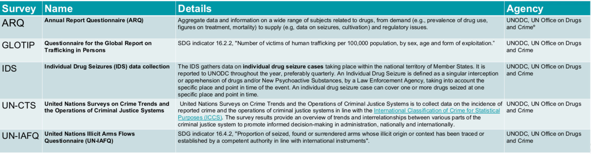

# Welcome to our Data-4-SDG Research Repository

### How to Navigate

This repository currently contains work from **4** project themes. 
1. Monitoring Global Aid - Focus: Small Island Developing States (SIDS)
2. Criminal Justice in SIDS
3. Maunalua Fishpond Heritage Center Dashboard
4. Mapping Tutorial for the United States - Affiliated Pacific Islands (USAPI)

Each of these project themes has it's own folder in this repository that contains all of the final data and code used for analysis. 
- Project Descriptions, Funders, Students, and Mentors are descriced for each project below

## Theme 1. Monitoring Global Aid - Focus: Small Island Developing States (SIDS)

 

**Goal of this work**

Subset data from the paper [*Monitoring Global Development Aid with Machine Learning*](https://www.nature.com/articles/s41893-022-00874-z) to visualize more granular descriptions of aid than the 17 SDG’s for Small Island Develping States (SIDS)

- How much aid is each SIDS receiving?:
  
   - For which sectors? (31 total)
  
- For SIDS as a whole, what proportion of the overall aid goes to each of the specific topics? (171 total)

**Results**

Final results are displayed and described in this R Publication: [SIDS-Focused Analysis of the Results from ‘Monitoring global development aid with machine learning](https://rpubs.com/connorflynn/1049427)

**Students**

[Quinn McHenry](https://github.com/QuinnMcHenry)

[Katherine Gonzalez](https://github.com/KatherineYG)

**Mentor**

[Connor Flynn](https://github.com/ConnorFlynn)

## Theme 2. Criminal Justice in SIDS

 

**Goal of this Work**

The main goal of this project is to assess the staus of Small Island Developing States (SIDS) on Criminal Justice-Oriented Sustainable Development Goals (SDG's). Throughout our data-collection process, we encountered significant amounts of mising data. This framed
  - Research Question 1: Are SIDS reporting data on Criminal Justice-Oriented Sustainable Development Goals less than Non-SIDS. This can inspire insight into the culture and systems of SIDS playing an important role into the survey response rates.
  - Research Aim 2: - Analyze the Global Organized Crime Index through a SIDS - specific lens and visualize the data in a manner that can be integrated into the UNDP SIDS Data Platform 

### Data 

We accessed the [UNODC Status of Country Data Submissions by Data Collection Campaign Year](https://dataunodc.un.org/content/ms-data-collection-log) to create a dataset based on completion of 5 surveys shown below.

[Global Organized Crime Index](https://ocindex.net/) 

### Results

All code and data for the final analyses can be founf in the *r_publication.Rmd*

## Theme 3. Maunalua Fishpond Heritage Center Dashboard

 

**About**

Nearly all of Hawai‘i’s freshwater springs have disappeared – many filled in for development, ending the fresh and salt water connection that is critical to the life cycle of many native species. In Kuli‘ou‘ou, we had a rare opportunity to permanently protect a fertile estuary that is home to rare freshwater limpets pipiwai and hapawai that cling to the Hawaiian drystack wall lining the spring, ‘ama‘ama (mullet) and āholehole (young Hawaiian flagtail) that feed on the prized green limu ‘ele‘ele that blankets the spring floor, native shrimp ‘opae ‘oeha‘a and ‘opae huna, and endangered ‘ae‘o (Hawaiian stilts) that feed in Kānewai Fishpond. This effort also protects the many cultural sites surrounding the spring including the mākāhā (fishpond sluice gate), and kū‘ula (fishing stone shrine) with an upright Kū stone balanced by a low Hina stone where the fishermen of old would have given offerings asking for a plentiful catch.

**Goal of this Work**

Clean, Analyze, and share data from Kalauhaʻihaʻi and Kānewai with the MFHC Team and surrounding community

**Results**

The primary research goal is to develop a Dashboard that displays pH, oxygen, conductivity, and temperature data collected by the Chaminade University of Honolulu Environmental Science Dept from Kalauhaʻihaʻi and Kānewai

[Beta Dashboard](https://connorflynn.shinyapps.io/maunalua-fishpond-heritage-center/?_ga=2.191367721.2028241035.1678747718-1779377801.1678413849#section-kalauhaihai)

## Theme 4. Mapping Tutorial for the United States - Affiliated Pacific Islands (USAPI)

**About**

The USAPI include the three U.S. Flag Territories of Guam, the Commonwealth of the Northern Mariana Islands, and American Samoa, as well as the three Freely Associated States (independent nations in a special compact relationship with the United States) of the Republic of Palau, the Republic of the Marshall Islands, and the Federated States of Micronesian (Pohnpei, Kosrae, Chuuk, and Yap).

The USAPI are populated by more than 500,000 inhabitants who live on hundreds of remote islands and atolls spanning millions of square miles of the Pacific Ocean and crossing five time zones, including the international dateline.  These islands are culturally and linguistically diverse with more than a dozen spoken languages. While the indigenous peoples of the USAPI are rich in culture they are considerably small in population.  The islands are socially, politically and economically fragile but they are bountiful with rich marine and land-based eco-systems and numerous wildlife that cannot be found anywhere else on earth.

**Goal of this Work**

 

Utlize the urbnmapr package to create choropleth maps of the US that include Guam, American Samoa, and the Commonwealth of the Northern Mariana Islands

The urbnmapr package is a good start but does not include:
- Palau
- Marshall Islands
- Federated States of Micronesia (FSM)

Next steps include:
- Shifting and Enlarging the geometries of the USAPI to be include on a standard US choropleth map

